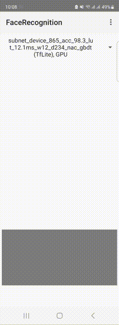

This repository contains accompanying code for the paper "AutoFace: How to Obtain Mobile Neural Network-based Facial Feature Extractor in Less Than 10 Minutes?" by Andrey V. Savchenko.

## Models
We provide several publicly available lightweight models for [face recognition](models/face_recognition) and [facial expression recognition](models/face_expressions) that obtained high accuracy of LFW (Labeled Faces in-the-Wild) and AffectNet datasets.

## Mobile demo
The demo Android application is available at our [Google drive](https://drive.google.com/drive/folders/1D6z7zeWxFXh63Njm9Y4t4Kt1uf5OfgrT?usp=sharing). Here is the result of its running on my personal device:

[]

## Research papers

If you use our models, please cite the following papers:

```BibTex
@inproceedings{savchenko2024,
  title={Device-Specific Facial Descriptors: Winning a Lottery with a SuperNet},
  author={Savchenko, Andrey V and Savchenko, Lyudmila V},
  booktitle={International Joint Conference on Artificial Intelligence (IJCAI) - under review},
}
```
